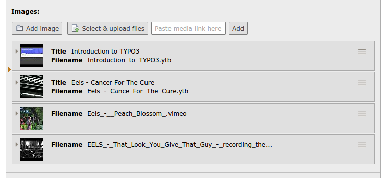
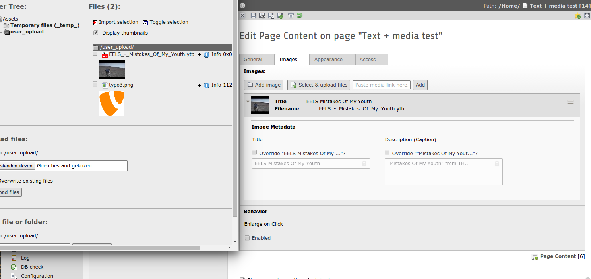

===========================================================================
FAL: Online media connector (back-port of TYPO3 CMS 7 online media support)
===========================================================================

The ame of this extension is to replace all normal image only fields by media fields. A "Text + Images" content element becomes a "Text + Media" and you got the same layout options as before.

The idea is to make it as easy as possible for editors to use all kind of media between there written content. So for example normal images like already possible with a default TYPO3 install but also YouTube video links or a presentation hosted on SlideShare.
And this with just selecting a existing media item from storage (fileadmin) or by providing a link to the online location which then internally gets transformed to a file (a custom container file) that's get added to you local file system with thumbnail support for previews and extended metadata support.

   Add new media directly to your content element

   Select already uploaded/added media element and add it to your content element

Current supported types:
------------------------
- YouTube (.youtube)
- Vimeo (.vimeo)

Features:
---------

**Editors**

- Possibility to select supported media items just like normal images from element browser
- Possibility to supply the link to a media to use direct in content element BE form
  The media item gets a preview thumbnail + title and caption fields just like a image

**Technical**

- Thumbnail/static image preview support
- MediaViewHelper to have a generic ViewHelper to show all supported media item types
- The ImageViewHelper can be Xclassed so the new file types are supported out of the box for all used ``f:image`` viewHelpers (not recommended)
- Hook render_singleMediaElement of css_styled_content is used to render online media with TypoScript
- Possibility to register your own Online Media item types

**Exmaple of using the media ViewHelper**

  .. code-block:: php

  <code title="Image Object">
        <f:media file="{file}" width="400" height="375" />
    </code>
    <output>
        
    </output>

    <code title="YouTube file">
      <f:media file="{file}" additionalConfig="{showinfo:1}" title="My title" class="media-object" width="300" height="200m" />
    </code>
    <output>
      <iframe src="//www.youtube.com/embed/abcdefg?autohide=1&amp;controls=2&amp;enablejsapi=1&amp;origin=mydomain.com&amp;showinfo=1" allowfullscreen="" width="300" height="168" class="media-object" title="My title"></iframe>
    </output>

**Example of registering your own online media file/service:**

  .. code-block:: php

    // Register your own online video service (the used key is also the bind file extension name)
    $GLOBALS['TYPO3_CONF_VARS']['SYS']['OnlineMediaHelpers']['myvideo'] = \MyCompany\Myextension\Helpers\MyVideoHelper::class;

    $rendererRegistry = \TYPO3\CMS\Core\Resource\Rendering\RendererRegistry::getInstance();
    $rendererRegistry->registerRendererClass(
        \MyCompany\Myextension\Rendering\MyVideoRenderer::class
    );

    // Register an custom mime-type for your videos
    $GLOBALS['TYPO3_CONF_VARS']['SYS']['FileInfo']['fileExtensionToMimeType']['myvideo'] = 'video/myvideo';

    // Register your custom file extension as allowed media file (< TYPO3 CMS 7.5)
    $GLOBALS['TYPO3_CONF_VARS']['GFX']['imagefile_ext'] .= ',myvideo';

    // Register your custom file extension as allowed media file (>= TYPO3 CMS 7.5)
    $GLOBALS['TYPO3_CONF_VARS']['SYS']['mediafile_ext'] .= ',myvideo';

Status:
-------

This is now mainly a back-port of the feature available in TYPO3 CMS since 7.5.

Requirements:
-------------
- TYPO3 => 6.2.4

